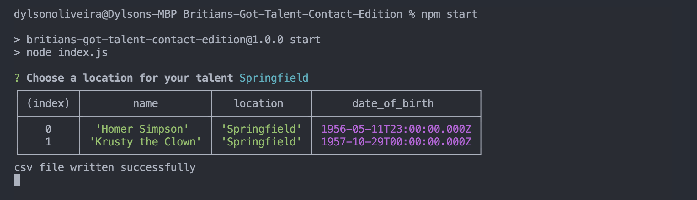

# Britians-Got-Talent-Contact-Edition

## About the app
Technical Assignment for Contact

BGT is an applcation focused on returning information from a hard-corded database, it implements validation for user input, SQL powered databasing, and is operared via the command-line powered using Node.js. Ultimately its designed to help retrieve information in a simple manner and create a csv file so that its user can easily export the data onto an excel file.

## Usage:
* To start the project all you need to do is run npm start after installing the node_modules;

## The Creators:

Dylson - https://github.com/Dylson14 

## Challenges:

* Configuring the function structure which allows users to start from the beggining without leaving the app
* New Technologies such as the CSV feature.

## Room to improve:
* Develop automated testing

## Application Requirements

* Application needs to take JSON array of talent, containing objects with name, location and date_of_birth attributes.
* The program should then filter the array of supplied talent, and output the names of talent whose location matches the location supplied. 
The supplied location should be considered case-insensitive, and the order in which names are outputted is not important.
* A feature to filter location by

## Overall

I had a lot of fun making this app and got to polish up my SQL skills as well as my Node.js abilities. I'm also very happy with the repo name!

## App Screenshot:

